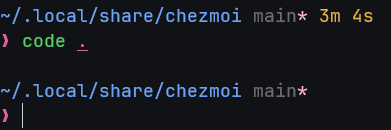

# Dotfiles

This currently assumes an ubuntu distro and is a oneline chezmoi install.

`sh -c "$(curl -fsLS https://chezmoi.io/get)" -- init --apply dre1080`

_**Recommended font:** [JetBrains Mono Nerd Font](https://github.com/ryanoasis/nerd-fonts/releases/latest/download/JetBrainsMono.tar.xz)_
